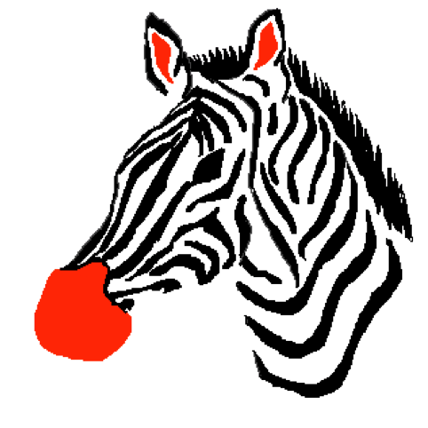
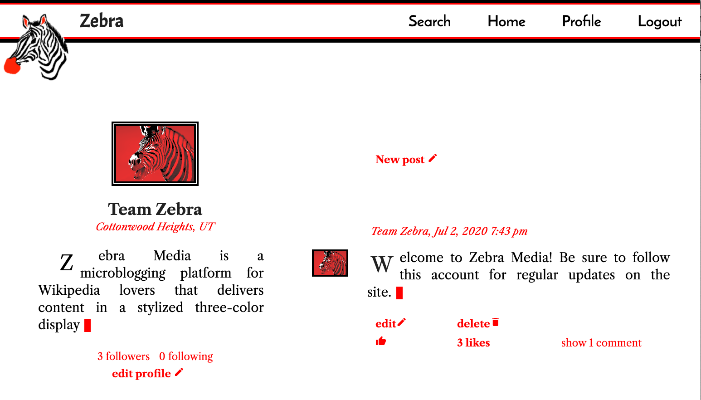

# Live Demo

Visit deployed version on **heroku** [here](https://morning-refuge-68363.herokuapp.com/) (initial load my take a moment)

## Instructions

If you don't wish to create your own account, log in using email: ZebraUser@yahoo.com and password: zebra

Otherwise, signup for your own account using your google account or by entering your email.  (Warning: a current unresolved issue is that the Sendgrid account verification email does not work for some domains.  yahoo.com and gmail.com should work fine).

# About

## Technologies Used:

* React
* Redux
* React Quill
* Node and Express
* MongoDB and Mongoose
* Passport JS
* Cookie-Session
* Google OAuth
* Sendgrid
* Wikipedia API

## Overview

What's black, white and red all over?

**Zebra Media** is a social media microblogging platform for lovers of **Wikipedia** built using **React** and **Redux** and custom plain CSS.  Everytime a user writes and submits a post or a comment, that post and comment is rendered such that each word is a clickable hyperlink to a relevant Wikipedia article.  This is achieved by running searches on each word through the **Wikipedia API** in the backend API, built in **Node** and **Express**.  Users can also enclose more than one word in backticks so that the whole phrase, rather than the individual words, becomes the search query.

In addition to this primary feature, Zebra Media distinguishes itself from Facebook and Twitter by allowing users to format their posts in bold and italic using a **React Quill** interface.  The posts and photos are displayed in a highly stylized three color black, red and white scheme.  The photos are displayed using a custom filter using **HTML canvas.**

User data is stored in a **MongoDB** database on Atlas Cloud Storage.  For simplicity, photos (of which there is only one at any given time per user) are stored in Object form.  Standard Social Media functions are included, including liking, commenting, following and unfollowing and searching for users.  A user's feed contains all of the posts of the user and the accounts they follow, sorted by timestamp.

Authentication is handled in accordance with best practices through **Google OAuth** and **Passport JS** in conjunction with **Cookie-Session.**  Additionally, emails are sent to users who do not sign in with Google OAuth for them to verify their accounts using **Sendgrid.**

The site is responsive for mobile (phone screens are, in fact, ideal) and the Logo was designed by the developer using **Microsoft Paint.**

## Where to find the most interesting code in this repository

* To see how the highly-formatted html submitted by users gets turned into a series of hyperlinks, check out [this backend function](https://github.com/ZalmanKelber/Zebra/blob/master/services/getContentDisplay.js)

* To see how comments are created and edited, check out [this component](https://github.com/ZalmanKelber/Zebra/blob/master/client/src/components/Post.js)

* To see how the custom filter is applied to photos, see [this function](https://github.com/ZalmanKelber/Zebra/blob/master/client/src/utils/renderCanvas.js)

## Issues and Bugs

* Sendgrid verification email doesn't work for some email domains other than yahoo and gmail
* Users can't navigate from a different profile to their own using the "profile" button on the Menu
* Users are not alerted when their post drafts exceed the character limit

## Features to Add

* Caching using **Redis** or similar technology
* Support for changing passwords
